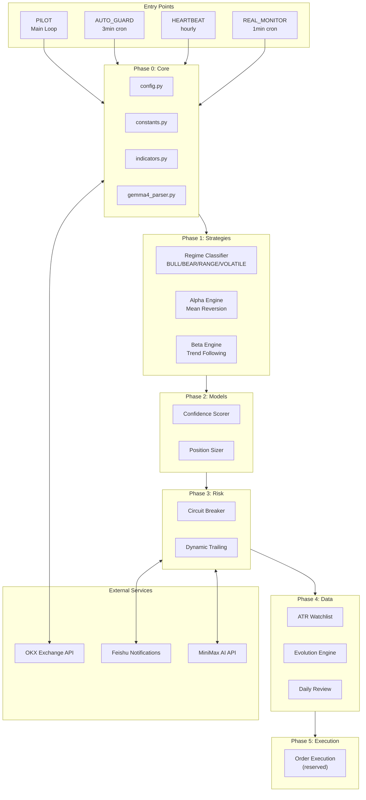

# Kronos Trading System


**Kronos** is an autonomous cryptocurrency trading system built with a 5-layer architecture. Currently running **v5.0** with OKX simulation trading (paper trades).

---

## System Architecture

### Mermaid Architecture Diagram



### ASCII Architecture Diagram

```
┌─────────────────────────────────────────────────────────────────────────────┐
│                           KRONOS v5.0 ARCHITECTURE                          │
├─────────────────────────────────────────────────────────────────────────────┤
│                                                                             │
│  ┌─────────────┐     ┌─────────────┐     ┌─────────────┐     ┌───────────┐ │
│  │   PILOT     │     │ AUTO_GUARD  │     │  HEARTBEAT  │     │REAL_MONITOR│ │
│  │ (Main Loop) │     │ (3min cron) │     │ (hourly)    │     │ (1min cron)│ │
│  └──────┬──────┘     └──────┬──────┘     └──────┬──────┘     └─────┬─────┘ │
│         │                    │                    │                  │       │
│         ▼                    ▼                    ▼                  ▼       │
│  ┌─────────────────────────────────────────────────────────────────────┐   │
│  │                        CORE ENGINE (Phase 0)                         │   │
│  │  ├── constants.py       - System-wide constants & enums              │   │
│  │  ├── config.py          - Environment-based configuration            │   │
│  │  └── indicators.py      - Technical indicator calculations           │   │
│  └─────────────────────────────────────────────────────────────────────┘   │
│                                    │                                        │
│         ┌──────────────────────────┼──────────────────────────┐           │
│         ▼                          ▼                          ▼           │
│  ┌─────────────┐          ┌─────────────┐           ┌─────────────┐        │
│  │ STRATEGIES  │          │   MODELS    │           │    RISK     │        │
│  │  (Phase 1)  │          │  (Phase 2)  │           │  (Phase 3)  │        │
│  ├─────────────┤          ├─────────────┤           ├─────────────┤        │
│  │ AlphaEngine │          │Confidence   │           │  Circuit    │        │
│  │ BetaEngine  │          │  Scorer     │           │  Breaker    │        │
│  │ Regime      │          │ Position    │           │  Dynamic    │        │
│  │ Classifier │          │ Sizer       │           │  Trailing   │        │
│  └─────────────┘          └─────────────┘           └─────────────┘        │
│                                    │                                        │
│                                    ▼                                        │
│                         ┌─────────────────┐                                 │
│                         │   DATA LAYER    │                                 │
│                         │   (Phase 4)    │                                 │
│                         ├─────────────────┤                                 │
│                         │ ATR Watchlist   │                                 │
│                         │ Evolution Engine│                                 │
│                         │ Daily Review    │                                 │
│                         └─────────────────┘                                 │
│                                                                             │
│  ┌─────────────────────────────────────────────────────────────────────┐   │
│  │                         EXTERNAL SERVICES                             │   │
│  │  ┌──────────────┐  ┌──────────────┐  ┌──────────────┐               │   │
│  │  │    OKX      │  │   Feishu     │  │   MiniMax    │               │   │
│  │  │ Exchange    │  │  (Lark)      │  │   AI API     │               │   │
│  │  │  API        │  │  Notifications│  │   (Judgment) │               │   │
│  │  └──────────────┘  └──────────────┘  └──────────────┘               │   │
│  └─────────────────────────────────────────────────────────────────────┘   │
└─────────────────────────────────────────────────────────────────────────────┘
```

---

## Data Pipeline Framework

### Complete Data Flow

```mermaid
flowchart LR
    subgraph INGESTION["1. Market Data Ingestion"]
        OKX_API["OKX API"] --> FETCH["fetch_okx_candles()"]
        FETCH --> DF["pandas DataFrame"]
        DF --> VALIDATE["Data Validation<br/>1h, 4h, 1d bars"]
    end

    subgraph REGIME["2. Regime Classification"]
        VALIDATE --> REGIME_CLS["RegimeClassifier"]
        REGIME_CLS --> REGIME_TYPE["RegimeType"]
        REGIME_TYPE -->|"CHOP <= 50"| ALPHA["Alpha Engine"]
        REGIME_TYPE -->|"CHOP > 50"| BETA["Beta Engine"]
    end

    subgraph SIGNAL["3. Signal Generation"]
        ALPHA --> SIG_ALPHA["SignalType<br/>LONG/SHORT"]
        BETA --> SIG_BETA["SignalType<br/>LONG/SHORT"]
        SIG_ALPHA --> CONF["ConfidenceScorer"]
        SIG_BETA --> CONF
        CONF --> SCORE["Score 0.0-1.0"]
    end

    subgraph RISK["4. Risk Management"]
        SCORE --> CIRCUIT["CircuitBreaker.is_allowed()"]
        CIRCUIT -->|if allowed| SIZER["PositionSizer.calculate()"]
        CIRCUIT -->|blocked| DROP["Cancel Trade"]
    end

    subgraph EXEC["5. Execution"]
        SIZER --> PAPER["Paper Trade Mode"]
        PAPER --> STATE["paper_trades.json"]
    end

    subgraph MONITOR["6. Monitoring Loop"]
        STATE --> REAL["real_monitor<br/>1min"]
        STATE --> GUARD["auto_guard<br/>3min"]
        STATE --> HEART["heartbeat<br/>hourly"]
    end
```



### Pipeline Stage Details

#### Stage 1: Data Ingestion

| Component | Description |
|-----------|-------------|
| `fetch_okx_candles()` | Fetches OHLCV data from OKX API |
| Multi-timeframe | Supports 1h, 4h, 1d bars |
| Validation | Ensures data completeness |

#### Stage 2: Regime Classification

| Regime | Condition | Strategy |
|--------|-----------|----------|
| `BULL_TREND` | Uptrend detected | Beta (Trend Following) |
| `BEAR_TREND` | Downtrend detected | Beta (Trend Following) |
| `RANGE_BOUND` | No clear trend | Alpha (Mean Reversion) |
| `VOLATILE` | High volatility | Reduced position |

#### Stage 3: Signal Generation

```python
# Signal confidence scoring
confidence = ConfidenceScorer.calculate(
    regime=regime,
    signal=signal,
    indicators={'rsi': 45, 'adx': 30}
)
```

#### Stage 4: Risk Management

| Check | Condition | Action |
|-------|-----------|--------|
| Circuit Breaker | 3 consecutive losses | Block new trades |
| Position Size | Based on confidence | Dynamic sizing |
| Trailing Stop | ADX-adaptive | Follow price |

#### Stage 5: Execution

| Mode | OKX_FLAG | Description |
|------|----------|-------------|
| Paper Trade | `1` | Simulated trading |
| Live Trade | `0` | Real execution |

---

## Current Status

| Item | Value |
|------|-------|
| **Version** | v5.0.0 |
| **Trading Mode** | Simulation (Paper Trading) |
| **Exchange** | OKX (testnet) |
| **Strategy** | Trend Following with RSI |
| **Active Components** | pilot, auto_guard, heartbeat, real_monitor |
| **OKX_FLAG** | `1` (simulation mode) |

### Trading Parameters
- **Stop Loss**: 1.5x ATR or 2% (whichever is smaller)
- **Take Profit**: 3x ATR or 6% (whichever is smaller)
- **Max Hold Time**: 72 hours (force exit)
- **Cooldown**: 2 hours between trades on same pair
- **Position Size**: Dynamic (based on confidence score)

---

## Quick Start

### Prerequisites
```bash
# Python 3.11+
python3 --version

# Install dependencies
cd ~/kronos
pip install -r requirements.txt

# Setup environment variables
cp ~/.hermes/.env.example ~/.hermes/.env
# Edit ~/.hermes/.env with your API keys
```

### Running the System

```bash
# 1. Run pilot (main trading loop)
python3 kronos_pilot.py

# 2. Run pilot with full daily report
python3 kronos_pilot.py --full

# 3. Check paper trading status
python3 kronos_pilot.py --status

# 4. View recent trade logs
python3 kronos_pilot.py --log

# 5. Run auto_guard (danger detection, every 3 min)
python3 kronos_auto_guard.py

# 6. Run heartbeat (hourly status report)
python3 kronos_heartbeat.py

# 7. Run real_monitor (position monitoring, every 1 min)
python3 real_monitor.py
```

### Cron Schedule (Production)
```bash
# Add to crontab for fully automated trading
*/1 * * * * cd ~/kronos && python3 real_monitor.py >> logs/real_monitor.log 2>&1
*/3 * * * * cd ~/kronos && python3 kronos_auto_guard.py >> logs/auto_guard.log 2>&1
0 * * * * cd ~/kronos && python3 kronos_heartbeat.py >> logs/heartbeat.log 2>&1
*/5 * * * * cd ~/kronos && python3 kronos_pilot.py >> logs/pilot.log 2>&1
```

---

## Directory Structure

```
kronos/
├── # Core System
├── kronos_pilot.py         # Main trading loop (signal generation, paper trades)
├── kronos_auto_guard.py    # Safety monitor (SL danger, liquidation risk)
├── kronos_heartbeat.py     # Hourly health check & reporting
├── real_monitor.py        # Real-time position monitor (OKX sync)
├── kronos_journal.py       # Trade journal & statistics
├── kronos_utils.py        # Utility functions
├── constants.py           # System-wide constants
│
├── # Core Modules (5-Layer Architecture)
├── core/
│   ├── config.py          # Configuration management
│   ├── engine.py          # Main engine (5-layer bus)
│   ├── indicators.py      # Technical indicators
│   ├── gemma4_parser.py   # Gemma4 model parser
│   └── logging_config.py  # Logging setup
│
├── strategies/             # Phase 1: Market Perception
│   ├── regime_classifier.py   # Market regime detection
│   ├── engine_alpha.py    # Alpha engine (CHOP range mode)
│   └── engine_beta.py     # Beta engine (TREND mode)
│
├── models/                # Phase 2: Confidence & Sizing
│   ├── confidence_scorer.py   # Signal confidence scoring
│   └── position_sizer.py  # Dynamic position sizing
│
├── risk/                  # Phase 3: Risk Management
│   ├── circuit_breaker.py    # Loss limit circuit breaker
│   └── dynamic_trailing.py   # Adaptive trailing stops
│
├── data/                  # Phase 4: Data & Review
│   ├── atr_watchlist.py   # ATR-based watchlist
│   ├── evolution_engine.py  # Strategy evolution
│   ├── atr_watchlist_state.json
│   └── evolution_state.json
│
├── execution/            # Phase 5: Execution Layer
│   └── (reserved for order execution)
│
├── # Trading Strategies
├── strategies/           # Additional strategy implementations
├── backtest_engine.py    # Backtesting engine
├── signal_factory.py     # Signal generation factory
│
├── # State Files
├── data/
│   ├── treasury.json     # Treasury/balance state
│   ├── journal.json      # Trade journal
│   ├── circuit.json      # Circuit breaker state
│   └── daily_dd.json     # Daily drawdown tracking
│
├── paper_trades.json     # Paper trading records (~/.hermes/cron/output/)
│
├── # Configuration
├── requirements.txt      # Python dependencies
├── requirements_locked.txt
├── .env                  # Environment variables (external)
│
├── # Documentation
├── README.md             # This file
├── ARCHITECTURE.md       # Detailed architecture docs
├── CLAUDE.md             # AI coding assistant guide
└── MEMORY.md             # System memory/persistence
```

---

## Configuration Guide

### Environment Variables

Create/edit `~/.hermes/.env`:

```bash
# OKX Exchange API
OKX_API_KEY=your_api_key_here
OKX_SECRET=your_secret_here
OKX_PASSPHRASE=your_passphrase

# OKX Trading Mode (IMPORTANT!)
# 0 = live trading
# 1 = simulation/testnet (paper trading)
OKX_FLAG=1

# Feishu (Lark) Notifications
FEISHU_APP_ID=your_app_id
FEISHU_APP_SECRET=your_app_secret
FEISHU_CHAT_ID=your_chat_id

# AI Judgment API (Optional)
MINIMAX_API_KEY=your_minimax_key
MINIMAX_BASE_URL=https://api.minimax.com/v1
```

### Trading Parameters

| Parameter | Environment Variable | Default | Description |
|-----------|---------------------|---------|-------------|
| Max Hold Hours | `MAX_HOLD_HOURS` | 72 | Maximum position holding time |
| Stop Loss % | `SL_PCT` | 1.0 | Stop loss percentage |
| Take Profit % | `TP_PCT` | 2.0 | Take profit percentage |
| SL Danger Threshold | `SL_DANGER_PCT` | 2.0 | SL距离现价<2%为极度危险 |
| Max Position % | `MAX_POSITION_PCT` | 10.0 | Maximum position size |

---

## Current Strategy: Trend Following with RSI

### Strategy Overview

The v5.0 strategy uses a **trend-following approach with RSI filtering**:

```
Entry Conditions (LONG):
├── RSI < 68 (not overbought)
├── ADX > 20 (trend is strong)
└── Price > EMA fast (uptrend confirmation)

Entry Conditions (SHORT):
├── RSI > 32 (not oversold)
├── ADX > 20 (trend is strong)
└── Price < EMA fast (downtrend confirmation)

Exit Conditions:
├── Stop Loss: 1.5x ATR or 2% (whichever is smaller)
├── Take Profit: 3x ATR or 6% (whichever is smaller)
├── Time Exit: 24-72 hours (force exit)
└── Trailing Stop: Dynamic based on ADX
```

### Pattern Whitelist (Learned)

The system maintains a **pattern whitelist** based on historical performance:

| Pattern | RSI Range | ADX Range | Win Rate |
|---------|-----------|-----------|----------|
| Strong Uptrend | 35-45 | >30 | 66.7% |
| Moderate Uptrend | 55-65 | 30-40 | 58.8% |
| Ranging | 45-55 | 20-30 | 50.0% |

### Risk Management

1. **Circuit Breaker**: 3 consecutive losses → pause trading
2. **Position Sizing**: Based on confidence score (0-1)
3. **Dynamic Treasury**: Adjusts limits based on account balance
4. **Time-based Filters**: Reduced position size during high-volatility periods

---

## Detailed Documentation

| Document | Description |
|----------|-------------|
| [ARCHITECTURE.md](ARCHITECTURE.md) | 5-layer architecture, components, data flow, state files |
| [CLAUDE.md](CLAUDE.md) | AI coding assistant guide, coding conventions |

---

## State Files

| File | Location | Purpose |
|------|----------|---------|
| `paper_trades.json` | `~/.hermes/cron/output/` | Paper trading records |
| `treasury.json` | `~/kronos/data/` | Account balance tracking |
| `journal.json` | `~/kronos/data/` | Trade history journal |
| `circuit.json` | `~/kronos/data/` | Circuit breaker state |
| `daily_dd.json` | `~/kronos/data/` | Daily drawdown records |
| `factor_context.json` | `~/kronos/` | Factor weights for IC calculation |
| `decision_journal.jsonl` | `~/kronos/` | AI decision audit log |

---

## Dependencies

```
# Core
pandas
numpy
requests
python-dotenv

# OKX
okx SDK (if using official SDK)

# AI
minimaxi (for AI judgment)

# Utilities
python-dateutil
```

See `requirements.txt` for full list.

---

## License

See LICENSE file for details.
